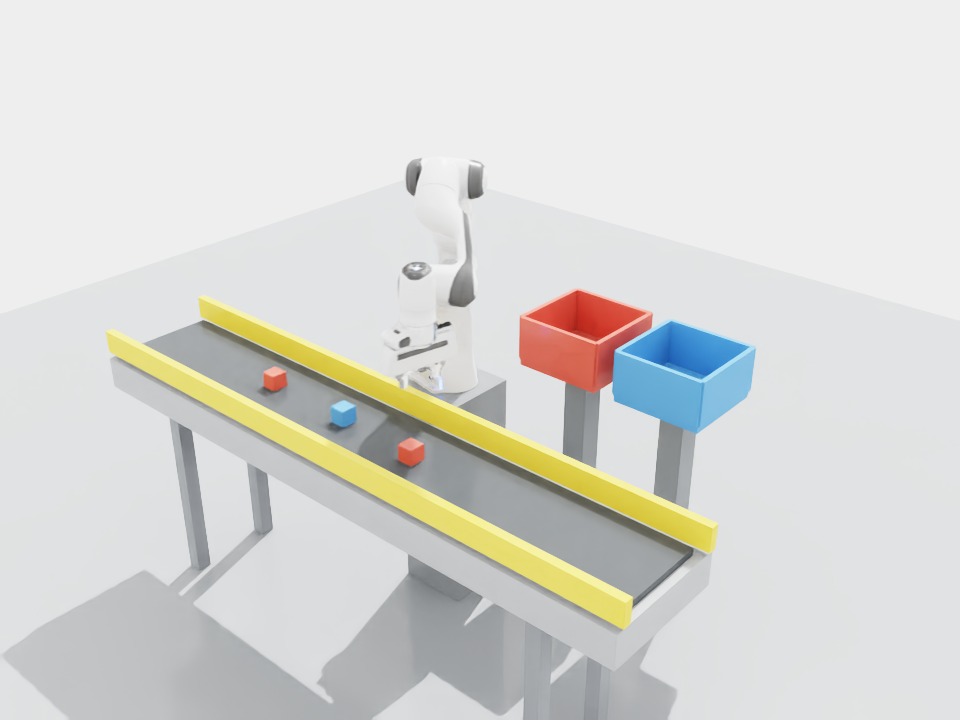
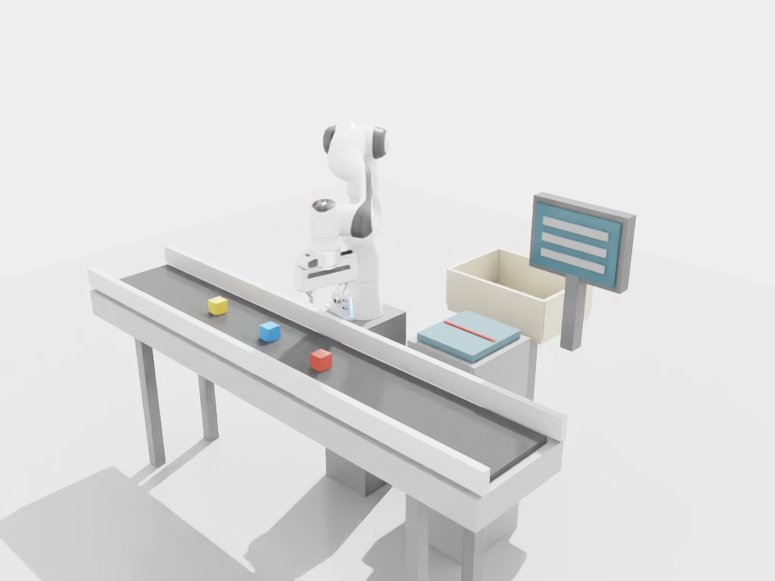
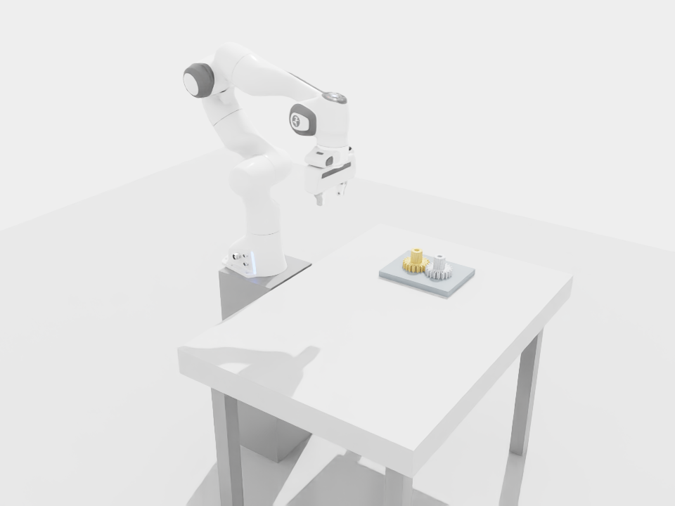
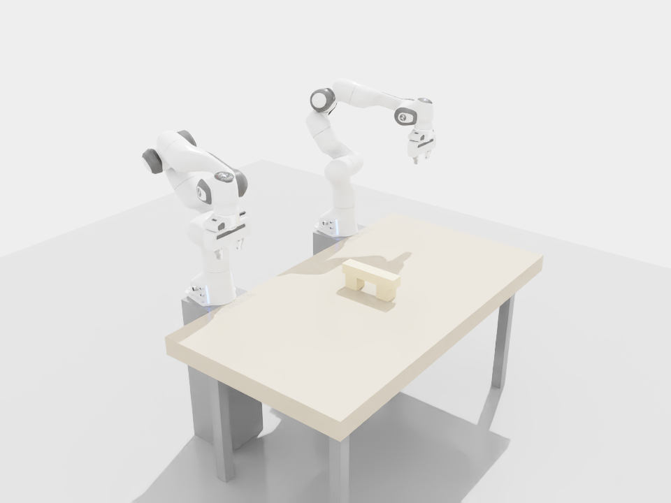
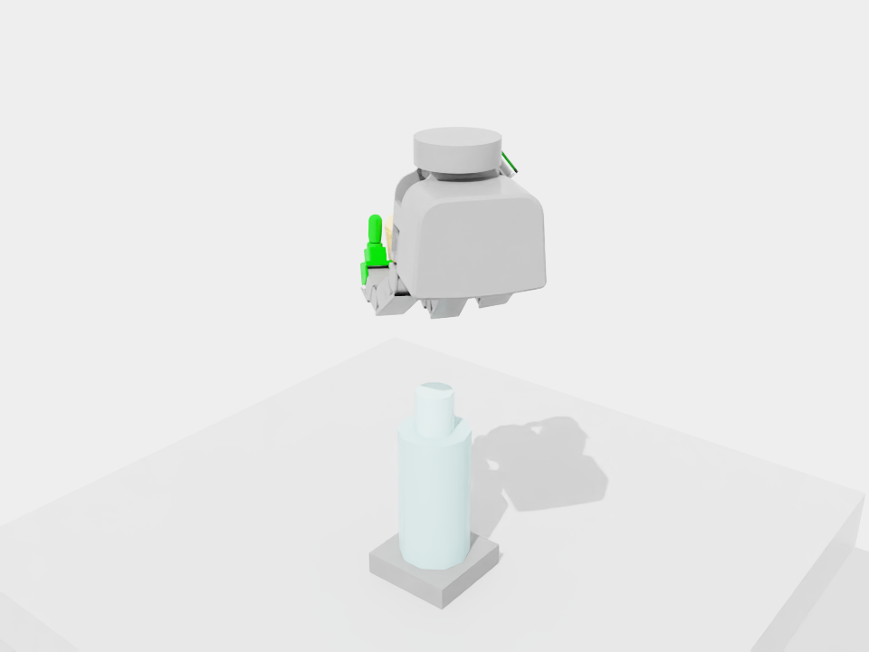
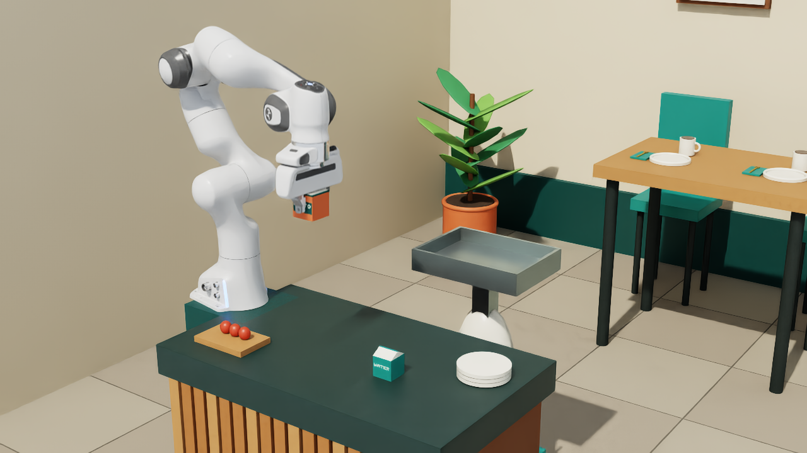
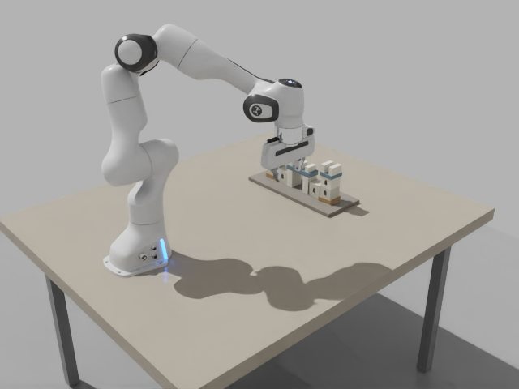

# physical-demo-lab

Robot manipulation demos in Isaac Sim, with scripted controllers, recorded
trajectories and videos.

[Getting Started](GETTING_STARTED.md) · [中文入门](docs/guides/getting-started.zh-CN.md)

## Quick Start

从 20 块城堡开始：Blender 生成积木场景，Franka 在 Isaac Sim 中逐块搭建，再导出执行轨迹。

只看场景，可以直接打开 [castle.blend](examples/castle20/castle.blend)，不需要 Isaac Sim。
生成场景需要 Blender 4.5；运行仿真还需要 Linux、NVIDIA RTX 显卡和 Isaac Sim 6.0.1。
先按 [Getting Started](GETTING_STARTED.md#1-get-the-repository-and-runtime) 安装环境并确认 NVIDIA EULA，然后在仓库根目录运行：

```bash
python3 scripts/castle.py build --output outputs/castle20-design --render

python3 scripts/castle.py run --design outputs/castle20-design \
  --output outputs/castle20-seed0 --seed 0 --gpu 0

python3 scripts/castle.py audit --run outputs/castle20-seed0 \
  --receipt outputs/castle20-seed0-audit.json

python3 scripts/castle.py export --run outputs/castle20-seed0 \
  --output outputs/castle20-seed0-keyframes
```

选择空闲 GPU，每次使用新的输出目录。
场景和仿真共用固定的 JSON 蓝图；手动修改 Blender 网格不会自动同步到仿真。
控制器使用模拟器中的物体状态，不需要训练模型或配置 LLM API。

运行目录保存 USD 场景、逐步轨迹、接触记录、视频和结果。
导出目录包含 `keyframes.json`、`waypoints.csv`、`events.json` 和来源清单。
关键点是执行记录的阶段端点，不是可直接重放的控制程序。
[查看轨迹示例](examples/castle20/trajectory/README.md) · [字段和单位](docs/guides/castle-outputs.md)

## Demo Gallery

点击图片查看各基础版的实现与运行结果。[截图来源](docs/previews/README.md)。

| 001 · 流水线颜色分拣 | 002 · 超市收银 |
| --- | --- |
| <a href="reports/bootstrap-validation.md"></a> | <a href="reports/demo002-checkout.md"></a> |
| 停带、接触抓取、按颜色放箱；已知位姿。 | 已知 SKU 的模拟扫描、计价与物理装袋。 |

| 003 · 齿轮插装 | 004 · 双臂搭桥 |
| --- | --- |
| <a href="reports/demo003-gears.md"></a> | <a href="reports/demo004-dual-blocks.md"></a> |
| 近似齿轮插轴、落座与释放；不验证精密传动。 | 双臂顺序搬运三件积木；释放后持续稳定。 |

| 005 · 灵巧手开盖 | 006 · 餐厅送餐 |
| --- | --- |
| <a href="reports/demo005-bottle-cap.md"></a> | <a href="reports/demo006-restaurant-showcase.md"></a> |
| Allegro 接触旋盖、脱扣与持盖；等效螺纹模型。 | 固定臂装餐、独立轮式车送达；不含桌面卸餐。 |

| 009 · 20 件城堡 |
| --- |
| <a href="reports/demo009-castle20.md"></a> |
| 接触抓取、搬运与脱手稳定；固定蓝图六种子 6/6。 |

## Documentation

- [任务规格、进度与报告](docs/README.md)
- [城堡复现验证](reports/castle-quickstart.md)
- [待办](docs/TODO.md)
