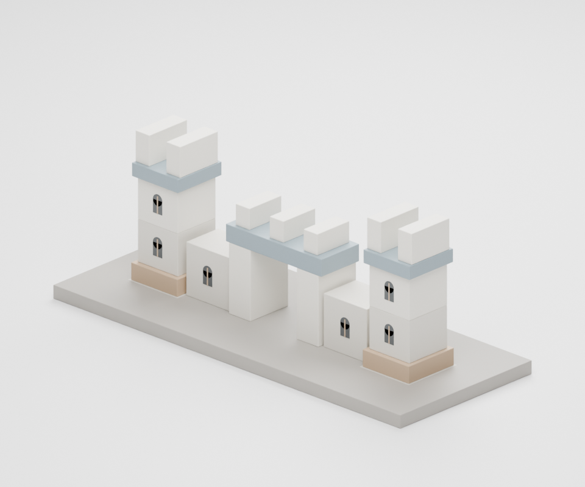
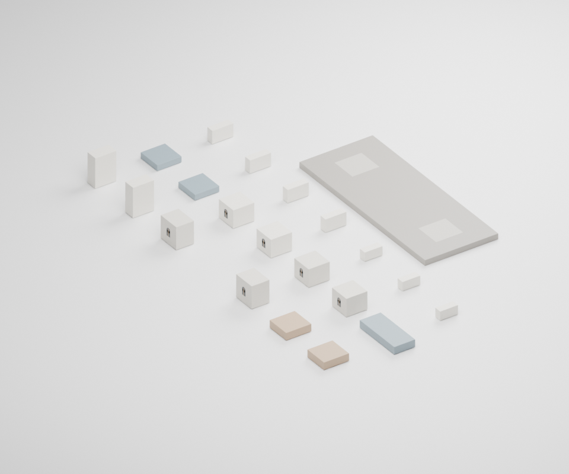
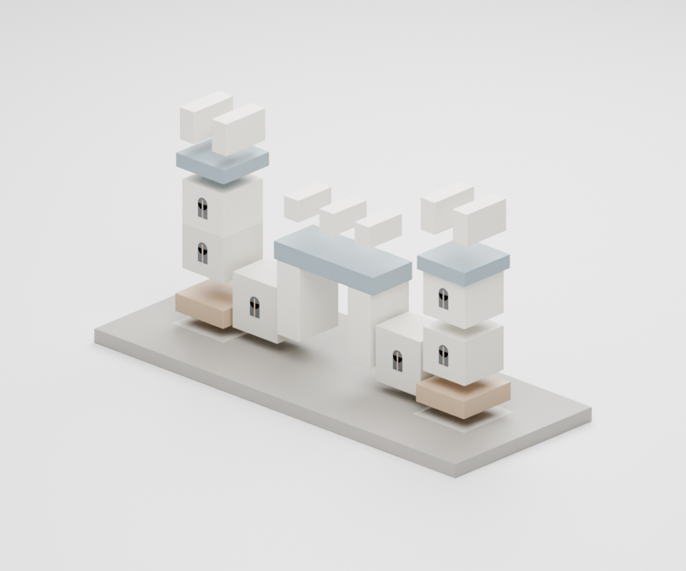

# Ready-to-Open Castle20

Open [castle.blend](castle.blend) in Blender 4.5. Select **Goal**, **Loose** or
**Exploded** in the Scene selector. No add-on or auto-run script is required.

| Goal | Loose Parts | Exploded Design |
| --- | --- | --- |
|  |  |  |

These images are Blender design renders, not robot trajectories. The bundle
contains twenty independent pieces, source identities, dimensions, loose and
target positions, and support metadata. The JSON is identical to the accepted
[physics blueprint](../../assets/block_castle/scene_spec.json).

- [Rebuild and run it](../../GETTING_STARTED.md)
- [Inspect real key-stage data](trajectory/README.md)
- [Reopened Blender checks](blender-audit.json)
- [File hashes and exact source paths](provenance.json)

The files were generated by [castle_blender.py](../../scripts/castle_blender.py),
not copied from a third-party model pack. The Blender builder uses the authored
castle blueprint already in this repository. Bevels and studio lighting are
visual-only. The complete robot rollout and external NVIDIA assets are not
bundled here.

To use this ready-made design after setting up the runtime:

```bash
python3 scripts/castle.py run --design examples/castle20 \
  --output outputs/castle20-bundled-seed0 --seed 0 --gpu 0
```

Run from the repository root, choose an idle GPU, and use a new output directory.
